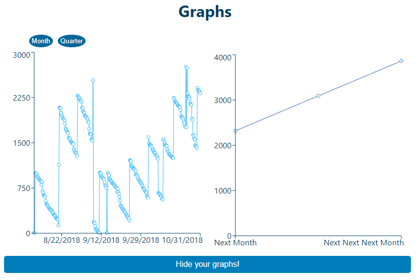
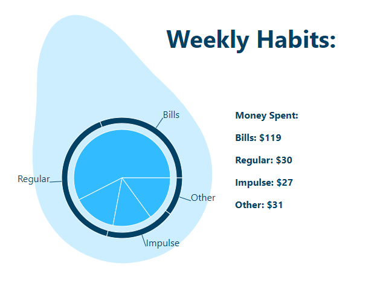

# Create-Camp-2021

A group project with work distributed between 3 designers and 3 developers, designed for Summer of Tech's Create Camp event.

Our group's website seeks to make saving and being good with money accessible and simplified to young adults. Titled "Blue Avocado", the program takes a CSV file of your bank transactions, assumed to be supplied directly from the bank. The user can then see graphs of their spending through the last month and a projection of their estimated savings in a months time. They will also be able to see an avocado-shaped pie chart of where their spending stands against the average New Zealander, with rough average spending taken from a stats.govt.nz dataset.

Blue Avocado is built with React.js and Node.js, using libraries such as PapaParse and ReChart for the technical functionality.

